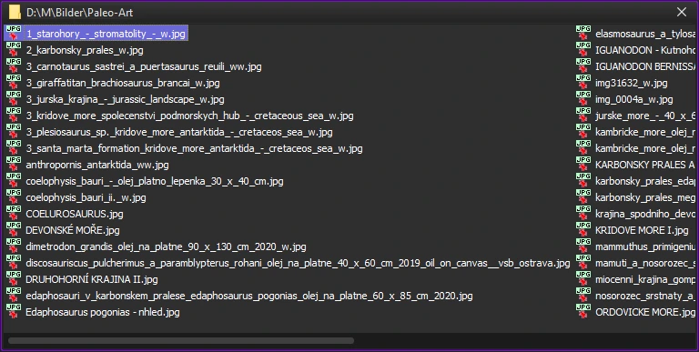

# mkFolderWidget

mkFolderWidget is a Qt6 based minimalist file manager optimized for space efficiency. It can be used with the included KWin script to tile its windows in a narrow column at the right side of the screen.
